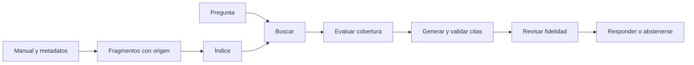
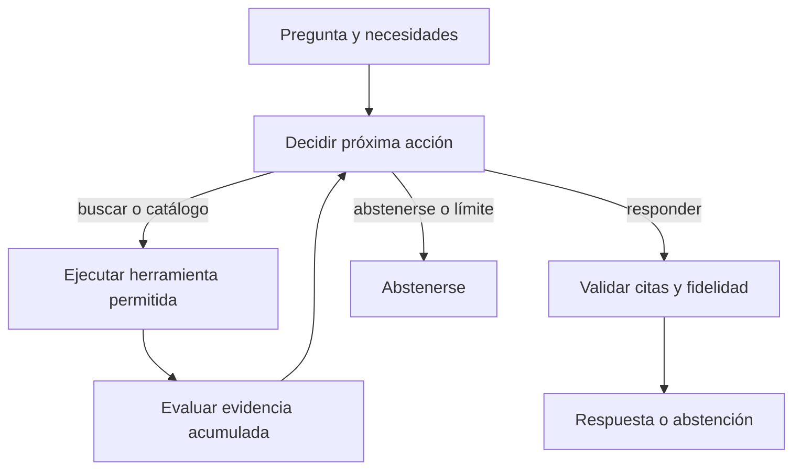

# RAG y Agentic RAG · Guía de la tienda La Esquina

Primero completa [08 · RAG desde cero](../clases/agentic_workflows/08_rag_desde_cero.ipynb).
Después sigue [09 · Agentic RAG](../clases/agentic_workflows/09_agentic_rag.ipynb).
Ambas clases funcionan sin clave de API. Comparten datos, recuperador y criterios
para que puedas explicar qué cambió y comprobarlo con una pregunta nueva.

## RAG tiene dos momentos

Antes de recibir preguntas, preparamos los documentos: leemos el manual, lo
dividimos en fragmentos, conservamos sus IDs y metadatos y construimos un índice.
Cuando llega una pregunta, buscamos fragmentos y generamos una respuesta usando
esa evidencia. Cambiar el prompt de respuesta no corrige un documento ausente.



El manual está en [rag_manual.json](../src/henry_agents/data/rag_manual.json).
Cada documento tiene título, categoría y vigencia. La política de envío de 2025
está archivada: no entra al índice. El catálogo de stock se consulta con una
herramienta distinta. Todos los datos son ficticios y locales; una fecha en un ID
no significa que consultamos información real actualizada de una tienda.

`fragmentar` divide por palabras, con tamaño y solapamiento configurables. Esto
permite observar cómo un fragmento demasiado pequeño separa una condición de su
excepción. Los IDs `ENVIO-2026-c01` permiten volver al documento. El solapamiento
puede producir evidencia repetida; las métricas se calculan por documento para
no contar el mismo origen varias veces. En una aplicación real, compara división
por secciones y por tokens antes de escoger el tamaño.

## Recuperar por palabras y por significado

La clase comienza con BM25: compara términos normalizados y su frecuencia en el
corpus. Es local, gratuito y fácil de inspeccionar. No es un embedding aprendido.
Su score ordena candidatos; no mide verdad ni confianza de una respuesta.

El experimento voluntario usa `OpenAIEmbeddings` y un `InMemoryVectorStore`, con
los mismos fragmentos vigentes. Un embedding es una representación numérica
aprendida; su similitud aproxima relaciones de significado y también puede
recuperar documentos equivocados. Activarlo consume API y requiere Internet.
No se instala un servidor vectorial ni se afirma que el índice sobreviva un reinicio.
El doble `HashEmbeddings` de las pruebas solo comprueba la integración del código;
no demuestra calidad semántica. Ver [modelos y configuración](MODELOS.md).

## La diferencia de Agentic RAG

El RAG clásico del ejercicio hace una búsqueda y pasa a evaluar y responder. El
agente observa resultados, elige otra acción, recibe una nueva observación y
decide otra vez. Puede reformular, buscar por categoría, consultar el catálogo,
responder o abstenerse. El programa valida esas acciones y sus argumentos.



| Componente | Offline, ejecución predeterminada | Live, activación explícita |
|---|---|---|
| Fragmentos, BM25, catálogo y grafo | Implementaciones reales | Las mismas |
| Próxima acción | Reglas visibles que leen resultados y faltantes | Un LLM devuelve `DecisionRAG` |
| Respuesta | Extractos literales | Un LLM devuelve afirmaciones con cita e ID |
| Fidelidad | Se exige igualdad entre afirmación y extracto | Un segundo paso con LLM contrasta afirmaciones y evidencia |
| Embeddings | No se usan | Experimento separado y voluntario |

El grafo offline demuestra el ciclo, pero sus reglas no son un agente con modelo
de lenguaje. En live, el modelo coordinador decide entre las acciones permitidas;
el grafo sigue controlando presupuesto, ejecución y validación. Un grafo por sí
solo no convierte una secuencia fija en un agente.

En “¿Hacen mandados?”, BM25 no encuentra esa palabra en el manual. La simulación
offline reconoce un alias explícito y, después de observar la búsqueda vacía,
reformula hacia entregas. No afirmamos comprensión general del español: prueba
otro regionalismo y explica si la regla lo conoce. En “¿Cuánto cuesta el envío al
Centro y retirar?”, `k=1` recupera solo una de las dos fuentes; el agente consulta
la necesidad faltante. Una pregunta por stock usa el catálogo, no una cifra
inventada a partir del manual.

## Tres comprobaciones diferentes

1. **Cobertura:** ¿hay evidencia para cada parte de la pregunta? `Necesidad` hace
   visibles las categorías y términos requeridos. Es un criterio didáctico de
   coincidencias, no una prueba semántica completa. Puedes definir necesidades
   explícitas para estudiar errores del clasificador de reglas.
2. **Referencias:** ¿el ID pertenece al contexto vigente y la cita literal existe?
   Se revisa también que las citas usadas cubran las necesidades. Encontrar un
   documento sin citarlo no cuenta como respaldo de una respuesta.
3. **Fidelidad:** ¿la afirmación conserva montos, negaciones, condiciones y alcance?
   “Hay envío gratis” con el ID correcto y una cita de “cuesta USD 2.00” pasa una
   revisión superficial de IDs y falla la revisión de contenido.

El modo offline solo acepta afirmaciones idénticas al extracto. Live permite
paráfrasis y las revisa con un juez LLM; ese juez también puede equivocarse.
Un schema correcto, una referencia existente o un juez favorable no certifican
verdad universal. Documentos recuperados son datos, incluidas posibles instrucciones
maliciosas en su texto; no adquieren autoridad sobre las reglas de la aplicación.

## Límites que puedes observar

Por defecto se permiten tres consultas a fuentes y cuatro decisiones. Una búsqueda
vacía y una consulta al catálogo consumen presupuesto. Repetir una consulta idéntica
se bloquea antes de ejecutarla de nuevo. Responder sin cubrir las necesidades
produce abstención. Agotar el límite no cuenta como una evaluación aprobada.

En live hay como máximo seis invocaciones lógicas de chat: cuatro decisiones,
una generación y una revisión de fidelidad. Los reintentos del SDK pueden producir
más solicitudes HTTP: este conteo no es un límite absoluto de facturación. Los
embeddings se miden aparte. `medir_costo()` registra tokens y estima costo de chat;
el evaluador registra llamadas, búsquedas y latencia, no calcula una factura total.

`eventos` conserva acción, consulta, resultados y motivo breve. Se usa para explicar
por qué una búsqueda cambió; no solicita razonamiento interno privado del modelo.
El estado comienza de nuevo por pregunta, vive en memoria y no reserva stock ni
produce compras, cobros o mensajes externos.

## Comparación reproducible

Desde la raíz del repo:

```bash
uv run python scripts/evaluate_rag.py --mode offline
uv run python proyectos/tienda_rag/solution.py
uv run pytest -q tests/test_rag.py
uv run python scripts/verify.py --mode offline --track workflows
```

El [dataset](../src/henry_agents/data/rag_casos.json) contiene doce preguntas:
directas, regionalismos, dos necesidades, stock, política archivada y consultas
fuera del manual. Ambos sistemas usan el mismo BM25, corpus y `k=1`. El agente
dispone de consultas adicionales; esa diferencia tiene un costo que debe reportarse.

El reporte `reports/rag-evaluation-offline.json` conserva estado esperado, fuentes
recuperadas/citadas, recall y precisión por documento, búsquedas, invocaciones de
chat, latencia y traza. Recall responde “¿encontramos los documentos necesarios?”;
precisión responde “¿qué proporción de lo recuperado era pertinente?”. Son métricas
de recuperación, distintas de fidelidad o utilidad de la respuesta.

La referencia offline responde 7 de 12 preguntas con RAG clásico y 11 con el ciclo,
usando 12 y 15 consultas respectivamente. Ambos cumplen sus doce comportamientos
esperados, incluida la abstención. Ese resultado describe estos casos y estas reglas;
no demuestra superioridad general de Agentic RAG ni calidad de los modelos live.

Después de configurar `.env`, puedes observar **una** comparación con API:

```bash
uv run python scripts/evaluate_rag.py --mode live --case RAG-06
```

Las decisiones live pueden variar. Los estados esperados son la referencia del
ejercicio offline, no una promesa de ruta exacta del modelo. Revisa la traza y las
citas, aunque el reporte pase. Las banderas de los notebooks 08/09 vienen apagadas;
`verify.py --mode live` no las activa automáticamente.

Continúa con el [proyecto RAG](../proyectos/tienda_rag/README.md): implementa tu
comparación, agrega casos propios y defiende cuándo la consulta adicional ayuda.

## Fuentes para profundizar

Consultadas el 6 de octubre de 2026; contrastadas con las librerías instaladas.

- [Agentic RAG de LangGraph](https://docs.langchain.com/oss/python/langgraph/agentic-rag):
  evaluación de documentos, reformulación y rutas condicionales.
- [Workflows y agentes](https://docs.langchain.com/oss/python/langgraph/workflows-agents):
  control del flujo y decisiones del modelo.
- [Embeddings de OpenAI](https://developers.openai.com/api/docs/guides/embeddings):
  representación aprendida y uso de la API.
- [Evaluar precisión de aplicaciones con LLM](https://developers.openai.com/api/docs/guides/optimizing-llm-accuracy):
  evaluar recuperación y generación en sus propios pasos.

Esta implementación y los materiales son originales de Henry; no son una copia
del tutorial ni una traducción del curso de origen.
